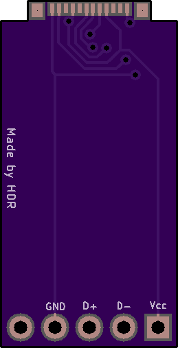

# Wired Xbox 360 Controller USB-C Mod (Work in progress - More info to come soon)

Diy USB-C conversion for wired controllers

More info coming soon

**Front**

**Back**

Part List:

[Female USB C socket 24pin 180 degree vertical connector]()

[ATtiny85-20SUR]()

## Assembly

1: Solder the 5 pin header & usb-c port to the pcb

2: Desolder the 5 pin header on the 360 controllers

3: solder the other side of the 5 pins on the pcb to the board
