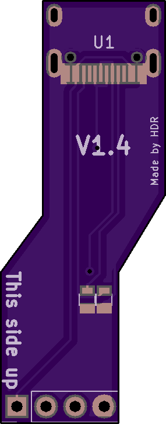
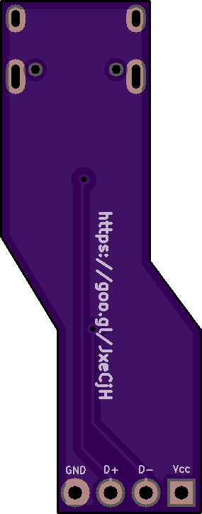
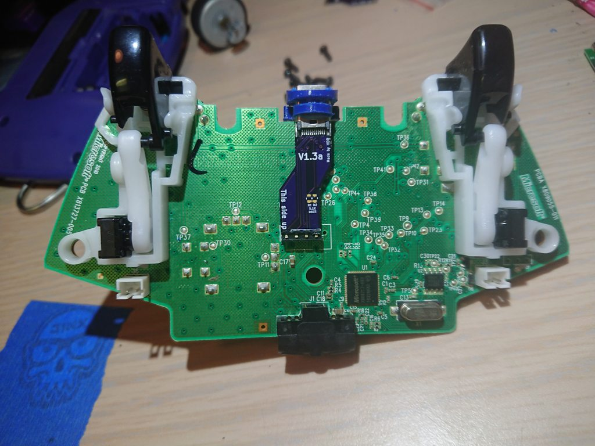

# Wired Xbox 360 Controller USB-C Mod - Rev 1.3

Diy USB-C conversion for wired controllers

Purchase the PCB on [OSHPark](https://oshpark.com/shared_projects/uOzjXaOX)

**Front**

**Back**

**Installed on the board**

**Port**

**BOM:**

Female USB C socket 24pin 180 degree vertical connector

1x5 2.54mm Pitch header

5.1K 0603 Resistor x 2 (Only required for usb-c to usb-c connections)

[3D Printed bezel](https://www.thingiverse.com/thing:3066354)

## Assembly

1: Solder the 5 pin header & usb-c port to the pcb

2: Desolder the 5 pin header on the 360 controllers

3: solder the other side of the 5 pins on the pcb to the board (You might have to bend the pins slightly to line up the port)

4: install the 3d printed bracket

5: screw the controller back together
